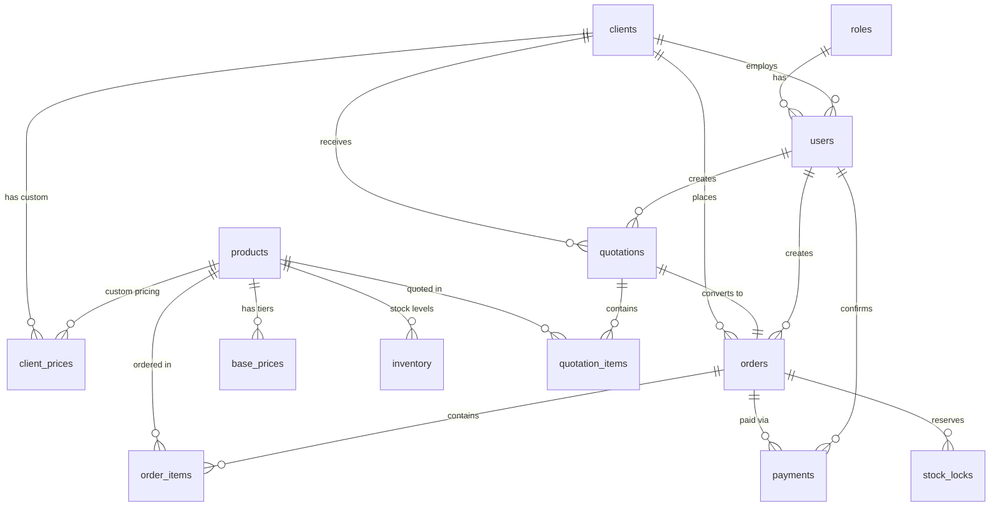

# SmartQuote Database Schema

## Overview

The SmartQuote database consists of 14 tables organized into the following functional areas:

1. **Authentication & Authorization**: `roles`, `users`
2. **Client Management**: `clients`
3. **Product Catalog**: `products`
4. **Pricing System**: `base_prices`, `client_prices`, `price_history`
5. **Inventory Management**: `inventory`
6. **Quotations**: `quotations`, `quotation_items`
7. **Orders & Workflow**: `orders`, `order_items`, `payments`, `stock_locks`

## Entity Relationship Diagram



## Table Definitions

### 1. roles
Defines user roles for RBAC (Role-Based Access Control).

| Column | Type | Constraints | Description |
|--------|------|-------------|-------------|
| id | SERIAL | PRIMARY KEY | Unique identifier |
| name | VARCHAR(50) | UNIQUE, NOT NULL | Role name: super_admin, admin, sales, client |
| description | TEXT | | Role description |
| created_at | TIMESTAMP | DEFAULT NOW() | Creation timestamp |

**Indexes**: Primary key on `id`, unique on `name`

---

### 2. users
User accounts with role-based access.

| Column | Type | Constraints | Description |
|--------|------|-------------|-------------|
| id | SERIAL | PRIMARY KEY | Unique identifier |
| email | VARCHAR(255) | UNIQUE, NOT NULL | User email (login) |
| password_hash | VARCHAR(255) | NOT NULL | Hashed password |
| full_name | VARCHAR(255) | NOT NULL | User's full name |
| role_id | INTEGER | FK → roles.id | User's role |
| client_id | INTEGER | FK → clients.id, NULL | Associated client (NULL for internal users) |
| is_active | BOOLEAN | DEFAULT TRUE | Account active status |
| created_at | TIMESTAMP | DEFAULT NOW() | Creation timestamp |
| updated_at | TIMESTAMP | DEFAULT NOW() | Last update timestamp |

**Indexes**: `email`, `role_id`

---

### 3. clients
Client company information.

| Column | Type | Constraints | Description |
|--------|------|-------------|-------------|
| id | SERIAL | PRIMARY KEY | Unique identifier |
| company_name | VARCHAR(255) | NOT NULL | Company name |
| contact_person | VARCHAR(255) | | Primary contact |
| email | VARCHAR(255) | | Contact email |
| phone | VARCHAR(50) | | Contact phone |
| address | TEXT | | Company address |
| tax_id | VARCHAR(100) | | Tax identification number |
| payment_terms | INTEGER | DEFAULT 30 | Payment terms in days |
| credit_limit | DECIMAL(15,2) | | Credit limit |
| is_active | BOOLEAN | DEFAULT TRUE | Active status |
| created_at | TIMESTAMP | DEFAULT NOW() | Creation timestamp |
| updated_at | TIMESTAMP | DEFAULT NOW() | Last update timestamp |

---

### 4. products
Product catalog.

| Column | Type | Constraints | Description |
|--------|------|-------------|-------------|
| id | SERIAL | PRIMARY KEY | Unique identifier |
| sku | VARCHAR(100) | UNIQUE, NOT NULL | Stock keeping unit |
| name | VARCHAR(255) | NOT NULL | Product name |
| description | TEXT | | Product description |
| category | VARCHAR(100) | | Product category |
| unit | VARCHAR(50) | DEFAULT 'pcs' | Unit of measure (pcs, kg, m, etc.) |
| min_order_qty | INTEGER | DEFAULT 1 | Minimum order quantity |
| lingxing_product_id | VARCHAR(100) | | ERP system reference |
| is_active | BOOLEAN | DEFAULT TRUE | Active status |
| created_at | TIMESTAMP | DEFAULT NOW() | Creation timestamp |
| updated_at | TIMESTAMP | DEFAULT NOW() | Last update timestamp |

**Indexes**: `sku`

---

### 5. base_prices
Base pricing with 3 tiers (X, S, A).

| Column | Type | Constraints | Description |
|--------|------|-------------|-------------|
| id | SERIAL | PRIMARY KEY | Unique identifier |
| product_id | INTEGER | FK → products.id | Product reference |
| tier | VARCHAR(10) | NOT NULL | Price tier: X, S, or A |
| price | DECIMAL(15,2) | NOT NULL | Price amount |
| effective_from | DATE | NOT NULL | Start date |
| effective_to | DATE | NULL | End date (NULL = active) |
| created_by | INTEGER | FK → users.id | Creator user |
| created_at | TIMESTAMP | DEFAULT NOW() | Creation timestamp |

**Unique Constraint**: `(product_id, tier, effective_from)`  
**Indexes**: `product_id`

---

### 6. client_prices
Client-specific pricing overrides with low-price protection.

| Column | Type | Constraints | Description |
|--------|------|-------------|-------------|
| id | SERIAL | PRIMARY KEY | Unique identifier |
| client_id | INTEGER | FK → clients.id | Client reference |
| product_id | INTEGER | FK → products.id | Product reference |
| price | DECIMAL(15,2) | NOT NULL | Custom price |
| is_protected | BOOLEAN | DEFAULT FALSE | Low-price protection flag |
| effective_from | DATE | NOT NULL | Start date |
| effective_to | DATE | NULL | End date (NULL = active) |
| created_by | INTEGER | FK → users.id | Creator user |
| created_at | TIMESTAMP | DEFAULT NOW() | Creation timestamp |
| updated_at | TIMESTAMP | DEFAULT NOW() | Last update timestamp |

**Unique Constraint**: `(client_id, product_id, effective_from)`  
**Indexes**: `client_id`, `product_id`

---

### 7. price_history
Audit trail for all price changes.

| Column | Type | Constraints | Description |
|--------|------|-------------|-------------|
| id | SERIAL | PRIMARY KEY | Unique identifier |
| product_id | INTEGER | FK → products.id | Product reference |
| client_id | INTEGER | NULL | Client (NULL for base prices) |
| tier | VARCHAR(10) | NULL | Tier (NULL for client prices) |
| old_price | DECIMAL(15,2) | | Previous price |
| new_price | DECIMAL(15,2) | | New price |
| change_type | VARCHAR(50) | | Type: base_update, client_override, batch_update |
| reason | TEXT | | Change reason |
| changed_by | INTEGER | FK → users.id | User who made change |
| changed_at | TIMESTAMP | DEFAULT NOW() | Change timestamp |

---

### 8. inventory
Stock levels synced from Lingxing ERP.

| Column | Type | Constraints | Description |
|--------|------|-------------|-------------|
| id | SERIAL | PRIMARY KEY | Unique identifier |
| product_id | INTEGER | FK → products.id | Product reference |
| warehouse_code | VARCHAR(50) | | Warehouse identifier |
| available_qty | INTEGER | DEFAULT 0 | Available quantity |
| reserved_qty | INTEGER | DEFAULT 0 | Reserved/locked quantity |
| last_sync_at | TIMESTAMP | | Last ERP sync time |
| lingxing_warehouse_id | VARCHAR(100) | | ERP warehouse reference |
| created_at | TIMESTAMP | DEFAULT NOW() | Creation timestamp |
| updated_at | TIMESTAMP | DEFAULT NOW() | Last update timestamp |

**Unique Constraint**: `(product_id, warehouse_code)`  
**Indexes**: `product_id`

**Computed Field**: `total_qty = available_qty + reserved_qty`

---

### 9. quotations
Quotations / Proforma Invoices.

| Column | Type | Constraints | Description |
|--------|------|-------------|-------------|
| id | SERIAL | PRIMARY KEY | Unique identifier |
| quotation_number | VARCHAR(50) | UNIQUE, NOT NULL | e.g., PI-2026-0001 |
| client_id | INTEGER | FK → clients.id | Client reference |
| status | VARCHAR(50) | DEFAULT 'draft' | Status: draft, sent, confirmed, expired, cancelled |
| total_amount | DECIMAL(15,2) | DEFAULT 0 | Total quotation amount |
| currency | VARCHAR(10) | DEFAULT 'USD' | Currency code |
| valid_until | DATE | | Expiration date |
| notes | TEXT | | Additional notes |
| created_by | INTEGER | FK → users.id | Creator user |
| created_at | TIMESTAMP | DEFAULT NOW() | Creation timestamp |
| updated_at | TIMESTAMP | DEFAULT NOW() | Last update timestamp |

**Indexes**: `client_id`, `status`

---

### 10. quotation_items
Line items in quotations.

| Column | Type | Constraints | Description |
|--------|------|-------------|-------------|
| id | SERIAL | PRIMARY KEY | Unique identifier |
| quotation_id | INTEGER | FK → quotations.id | Quotation reference |
| product_id | INTEGER | FK → products.id | Product reference |
| quantity | INTEGER | NOT NULL | Quantity |
| unit_price | DECIMAL(15,2) | NOT NULL | Price per unit |
| discount_percent | DECIMAL(5,2) | DEFAULT 0 | Discount percentage |
| notes | TEXT | | Line item notes |
| created_at | TIMESTAMP | DEFAULT NOW() | Creation timestamp |

**Computed Field**: `line_total = quantity * unit_price * (1 - discount_percent / 100)`

---

### 11. orders
Orders (confirmed quotations).

| Column | Type | Constraints | Description |
|--------|------|-------------|-------------|
| id | SERIAL | PRIMARY KEY | Unique identifier |
| order_number | VARCHAR(50) | UNIQUE, NOT NULL | e.g., SO-2026-0001 |
| quotation_id | INTEGER | FK → quotations.id | Source quotation |
| client_id | INTEGER | FK → clients.id | Client reference |
| status | VARCHAR(50) | DEFAULT 'pending_payment' | Status: pending_payment, paid, processing, shipped, completed, cancelled |
| total_amount | DECIMAL(15,2) | DEFAULT 0 | Total order amount |
| currency | VARCHAR(10) | DEFAULT 'USD' | Currency code |
| payment_status | VARCHAR(50) | DEFAULT 'unpaid' | Payment status: unpaid, partial, paid |
| stock_locked | BOOLEAN | DEFAULT FALSE | Stock reservation status |
| notes | TEXT | | Additional notes |
| created_by | INTEGER | FK → users.id | Creator user |
| created_at | TIMESTAMP | DEFAULT NOW() | Creation timestamp |
| updated_at | TIMESTAMP | DEFAULT NOW() | Last update timestamp |

**Indexes**: `client_id`, `status`

---

### 12. order_items
Line items in orders.

| Column | Type | Constraints | Description |
|--------|------|-------------|-------------|
| id | SERIAL | PRIMARY KEY | Unique identifier |
| order_id | INTEGER | FK → orders.id | Order reference |
| product_id | INTEGER | FK → products.id | Product reference |
| quantity | INTEGER | NOT NULL | Quantity |
| unit_price | DECIMAL(15,2) | NOT NULL | Price per unit |
| discount_percent | DECIMAL(5,2) | DEFAULT 0 | Discount percentage |
| notes | TEXT | | Line item notes |
| created_at | TIMESTAMP | DEFAULT NOW() | Creation timestamp |

**Computed Field**: `line_total = quantity * unit_price * (1 - discount_percent / 100)`

---

### 13. payments
Payment records for orders.

| Column | Type | Constraints | Description |
|--------|------|-------------|-------------|
| id | SERIAL | PRIMARY KEY | Unique identifier |
| order_id | INTEGER | FK → orders.id | Order reference |
| payment_method | VARCHAR(50) | | Method: wire_transfer, credit_card, paypal, etc. |
| amount | DECIMAL(15,2) | NOT NULL | Payment amount |
| currency | VARCHAR(10) | DEFAULT 'USD' | Currency code |
| payment_date | DATE | | Payment date |
| reference_number | VARCHAR(100) | | Payment reference |
| status | VARCHAR(50) | DEFAULT 'pending' | Status: pending, confirmed, failed |
| confirmed_by | INTEGER | FK → users.id | Admin who confirmed |
| confirmed_at | TIMESTAMP | | Confirmation timestamp |
| notes | TEXT | | Additional notes |
| created_at | TIMESTAMP | DEFAULT NOW() | Creation timestamp |

---

### 14. stock_locks
Reserved inventory for orders.

| Column | Type | Constraints | Description |
|--------|------|-------------|-------------|
| id | SERIAL | PRIMARY KEY | Unique identifier |
| order_id | INTEGER | FK → orders.id | Order reference |
| product_id | INTEGER | FK → products.id | Product reference |
| warehouse_code | VARCHAR(50) | | Warehouse identifier |
| quantity | INTEGER | NOT NULL | Locked quantity |
| locked_at | TIMESTAMP | DEFAULT NOW() | Lock timestamp |
| locked_by | INTEGER | FK → users.id | User who locked |
| released_at | TIMESTAMP | | Release timestamp |
| status | VARCHAR(50) | DEFAULT 'locked' | Status: locked, released, fulfilled |

---

## Key Business Rules

### Pricing Engine

1. **3-Tier Base Pricing**: Every product has base prices for tiers X, S, and A
2. **Client-Specific Overrides**: Clients can have custom prices that override base tiers
3. **Low-Price Protection**: When base prices change, client prices are only updated if they are **higher** than the new base price
4. **Price History**: All price changes are logged in `price_history` for audit purposes

### Order Workflow

1. **Quotation → PI Generation**: Sales creates quotation, generates PI
2. **Payment Confirmation**: Admin manually confirms payment
3. **Stock Locking**: After payment confirmation, stock is locked in inventory
4. **Order Fulfillment**: Stock locks are released when order is fulfilled

### Inventory Management

- Inventory is synced from Lingxing ERP (mock API for now)
- `available_qty`: Stock available for new orders
- `reserved_qty`: Stock locked for confirmed orders
- Stock locks prevent overselling

---

## Database Initialization

### Step 1: Create Database

```sql
CREATE DATABASE smartquote;
```

### Step 2: Run Migrations

```bash
cd backend
alembic upgrade head
```

### Step 3: Seed Initial Data

```bash
python -m app.seed
```

This will create:
- Default roles (super_admin, admin, sales, client)
- Admin user account
- Sample products and pricing
